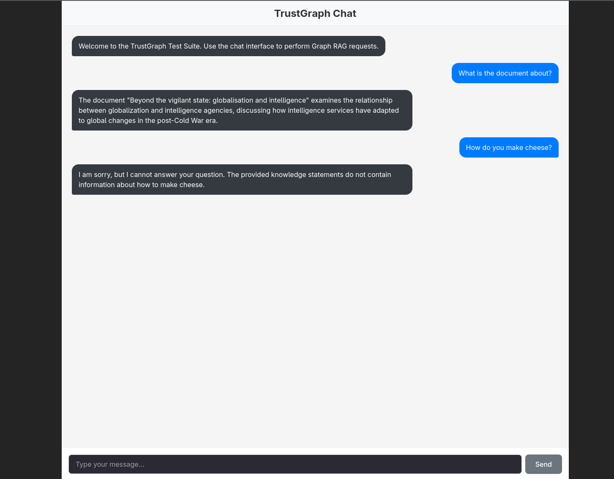

# Building a TrustGraph App with Claude Code

This is a transcript of working prompts that successfully built a React chat application using TrustGraph. A lot of Claude output has been trimmed for brevity.



## Prompts

**Create a React application in this directory. Use:**
- Typescript
- Vite

This might work:
```
npx --yes create-vite . --template react-ts
```

---

**Downgrade to React 18**

---

**Install @trustgraph/react-state and read the README.**

---

**Update vite.config.ts to proxy to the TrustGraph websocket in line with the README you just read.**

---

**Now replace the React app placeholder page with a real application:**

Chat Interface: Build a classic conversational UI with:
- A scrollable message list displaying the conversation history
- User messages displayed on the right side in blue
- Agent responses displayed on the left side in dark gray
- Auto-scrolling to the latest message
- An input field for message entry at the bottom
- A "Send" button that also responds to the Enter/Return key
- Loading state showing "Sending..." on the button while processing
- Disabled input during message submission

Use the TrustGraph GraphRAG service to provide messages. Use collection 'default' flow 'default'. Operate as user 'trustgraph'.

---

**Run npm build and fix any problems**

---

**It overflows the screen top and bottom, can you fix?**
